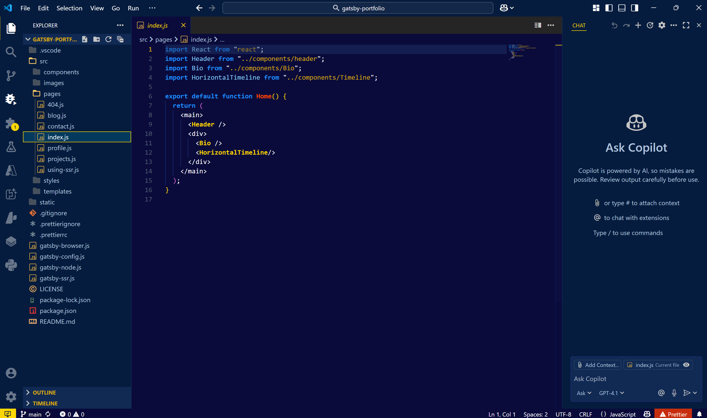
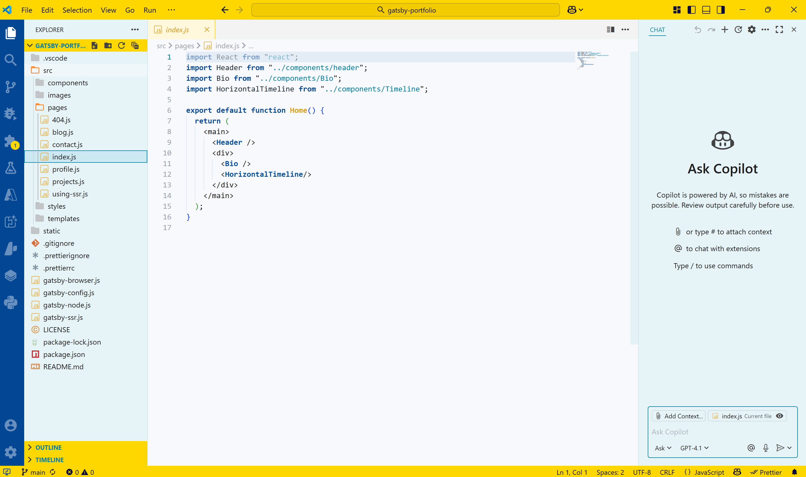

# ⚽ Chelsea Pride — VS Code Theme

A bold, stylish, and readable VS Code theme inspired by **Chelsea FC** — available in both **dark (Home)** and **light (Away)** versions.

<div align="center">
  
  
</div>

---

## 🎨 Themes Included

| Name                   | Description                         |
|------------------------|-------------------------------------|
| 🟦 Chelsea Pride       | Dark mode — royal blue & gold       |
| 🟡 Chelsea Pride Away  | Light mode — gold, teal, clean lines|

---

## 🖼 Preview

### 🟦 Dark Mode (Home)
> Royal Blue, Golden Tabs, Midnight Panel



### 🟡 Light Mode (Away)
> Bright, Legible, Inspired by 23/24 Away Kit



---

## 🚀 Installation

### From VS Code Marketplace

1. Open Extensions panel (`Ctrl + Shift + X`)
2. Search for:  Chelsea Pride Theme
3. Click **Install**, then choose:

- `Chelsea Pride`
- `Chelsea Pride Away`

### Or via Terminal

```bash
code --install-extension ranojoy.chelsea-pride-theme
